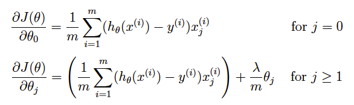
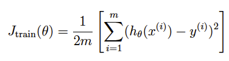

# Machine Learning Algorithms

This is a collection of notes and code for machine learning algorithms.

Most of these will be Matlab/Octave files. Would like to add some Python/Numpy implementations later.

## Linear regression

Regularized linear regression has the following cost function:

Correspondingly, the partial derivative of regularized linear regression's cost for θj is defined as:

To plot the learning curve, we need a training and cross validation set
error for different training set sizes. To obtain different training set sizes,
use different subsets of the original training set X. Specifically, for
a training set size of i, you should use the first i examples (i.e., X(1:i,:)
and y(1:i)).

You can use the trainLinearRegression() function to find the θ parameters. Note
that the lambda is passed as a parameter to the learningCurve function.
After learning the θ parameters, you should compute the error on the training
and cross validation sets. Recall that the training error for a dataset is
defined as:

In particular, note that the training error does not include the regularization
term. One way to compute the training error is to use your existing
cost function and set λ to 0 only when using it to compute the training error
and cross validation error. When you are computing the training set error,
make sure you compute it on the training subset (i.e., X(1:n,:) and y(1:n))
(instead of the entire training set). However, for the cross validation error,
you should compute it over the entire cross validation set.

## Logistic Regression

*coming soon*

## Multi-class Classification

*coming soon*

## Neural Networks

*coming soon*

## Neural Network Learning

*coming soon*

## Regularized Linear Regression

*coming soon*

## Support Vector Machines

*coming soon*